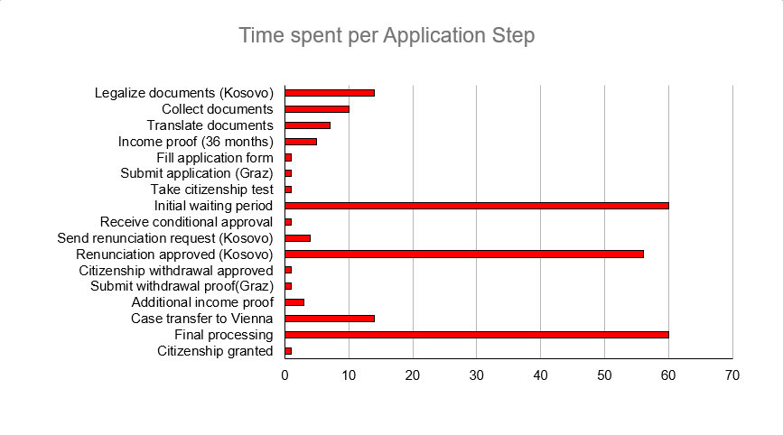
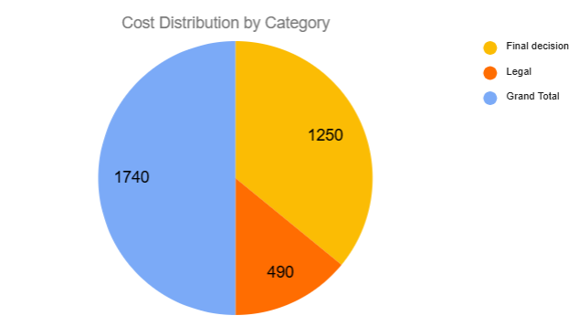
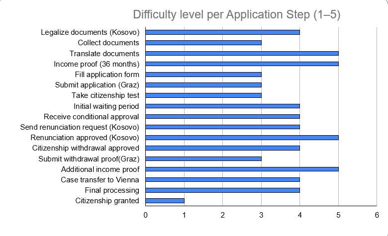

# Navigating Austrian Citizenship Independently

## A Data Analysis of Time, Cost, and Bureaucratic Complexity

This project analyzes the Austrian citizenship application process using a self-collected dataset based on a real applicant experience. The goal is to identify key challenges related to time, cost, and procedural complexity.

---

## About Me

I am a Digital Humanities student at the University of Vienna with a strong interest in data analysis, organization, and real-world problem solving.  

This project reflects my ability to transform a personal, complex bureaucratic experience into a structured data analysis using multiple tools.

---

## Project Overview

The dataset documents 17 steps of the Austrian citizenship process, including:

- time required for each step (in days)
- cost associated with each step (in €)
- perceived difficulty (scale 1–5)
- process category and phase

The analysis focuses on identifying:

- the most time-consuming stages  
- the most costly requirements  
- the most complex steps  
- relationships between time, cost, and difficulty  

---

## 🛠 Tools Used

- **Excel** → data collection, cleaning, visualization  
- **Python (pandas)** → data exploration and grouped analysis  
- **SQL (SQLite)** → querying and summary statistics  
- **Google Docs** → case study documentation  

---

## Key Findings

- Waiting periods account for the majority of total process time  
- Costs are concentrated in legal requirements and final approval  
- The most complex steps involve legal, financial, and cross-border processes  
- Time and difficulty are not directly correlated  
- External dependencies (Kosovo) significantly increase process duration  

---

## Visualizations

### Time Analysis

### Cost Analysis

### Difficulty Analysis

---

##  Process

The dataset was cleaned and standardized using Excel. Python was used to explore the data and calculate grouped summaries using pandas. SQL was used to query the dataset, calculate totals and averages, and generate summary tables.

---

## Full Case Study

You can view the complete report here:

[Download PDF](Navigating%20Austrian%20Citizenship%20Independently_Agron_Aziri.pdf)

---

##  Project Structure
citizenship-case-study/

│

├── README.md
├── citizenship_analysis.py
├── sql_queries.sql
├── data/
│ └── citizenship.csv
├── images/
│ ├── time_chart.png
│ ├── cost_chart.png
│ └── difficulty_chart.png

---

- ## Case Study Summary

This case study examines the Austrian citizenship process using a self-collected dataset of 17 steps. The analysis was conducted using Excel, Python, and SQL to identify patterns in time, cost, and complexity. The findings show that waiting periods dominate total duration, costs are concentrated in legal and final stages, and the most difficult steps involve legal and financial requirements. The project demonstrates the ability to collect, clean, analyze, and communicate data-driven insights.
